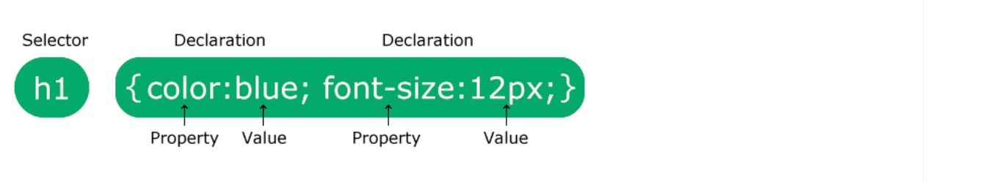

# CSS-doc
Un repositorio para aprender y compartir todo sobre CSS.

CSS es el lenguaje que usamos para dar estilo a un documento HTML.

CSS describe cómo deben mostrarse los elementos HTML.

# ¿Qué es CSS?

- CSS significa hojas de estilo en cascada
- CSS describe cómo se deben mostrar los elementos HTML en la pantalla, el papel o en otros medios.
- CSS ahorra mucho trabajo. Puede controlar el diseño de varias páginas web a la vez.
- Las hojas de estilo externas se almacenan en archivos CSS

# ¿Por qué utilizar CSS?

CSS se utiliza para definir estilos para sus páginas web, incluido el diseño, la disposición y las variaciones de visualización para diferentes dispositivos y tamaños de pantalla.

# CSS resolvió un gran problema

¡HTML NUNCA fue pensado para contener etiquetas para formatear una página web!

HTML fue creado para describir el contenido de una página web, como:

<h1>Esto es un encabezado</h1>

<p>Este es un párrafo.</p>

Cuando se añadieron etiquetas como <font> y atributos de color a la especificación HTML 3.2, empezó una pesadilla para los desarrolladores web. El desarrollo de sitios web de gran tamaño, en los que se añadían fuentes e información de color a cada página, se convirtió en un proceso largo y costoso.

Para resolver este problema, el Consorcio World Wide Web (W3C) creó CSS.

¡CSS eliminó el formato de estilo de la página HTML!

# ¡CSS ahorra mucho trabajo!

Las definiciones de estilo normalmente se guardan en archivos .css externos.

¡Con un archivo de hoja de estilo externo, puedes cambiar el aspecto de un sitio web completo modificando solo un archivo!

# **Sintaxis CSS**

Una regla CSS consta de un selector y un bloque de declaración.



El selector apunta al elemento HTML al que desea aplicar estilo.

El bloque de declaración contiene una o más declaraciones separadas por punto y coma.

Cada declaración incluye un nombre de propiedad CSS y un valor, separados por dos puntos.

Las declaraciones CSS múltiples se separan con punto y coma, y los bloques de declaración están rodeados por llaves.

## ejemplo 
todos los elementos `<p>` estarán alineados al centro, con un color de texto rojo:

```css
p {
  color: red;
  text-align: center;
}
```

### Ejemplo explicado
`p` es un selector en CSS (apunta al elemento HTML al que quieres aplicar estilo: `<p>`).
`color` es una propiedad, y redes el valor de la propiedad
`text-align` es una propiedad, y centeres el valor de la propiedad